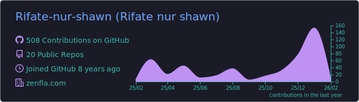
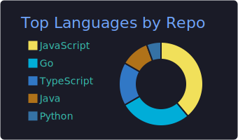
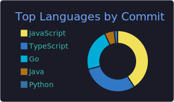
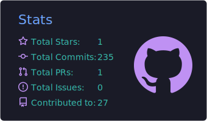

# 👋 Hi, I'm Rifate Nur Shawn  
### 🎓 Computer Science & Engineering Student

---

## 💫 About Me

- 🎓 Currently studying **Computer Science & Engineering**
- 💻 Interested in **Software Development, Web Technologies, and Systems**
- 🌱 Actively learning and building projects
- 🎯 Focused on improving problem-solving and practical skills

---

## 🌐 Socials

---

## 💻 Tech Stack

---

## 📊 GitHub Activity & Metrics  
*(Auto-generated via your existing GitHub Action)*

  

 

<table>
<tr>
<td>
  
</td>
<td>
  
</td>
<td>
  
</td>
</tr>
</table>

---

## ✍️ Random Dev Quote

---

### 🤝 Open to learning, collaboration, and growth  

